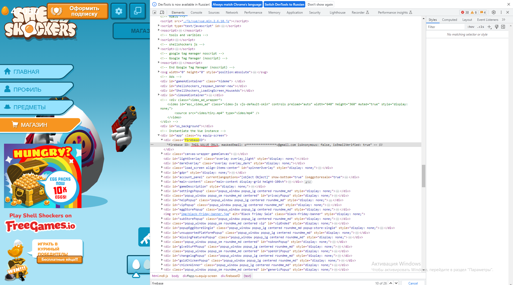

# Shellshockers

## First
1. you should get your firebase key, like on screenshot below

2. than paste it into script poc into var 'YOUR_FIREBASE_ID'

3. play with variable 'START_NUMBER' make it bigger till you get result

4. have fun until its got fixed